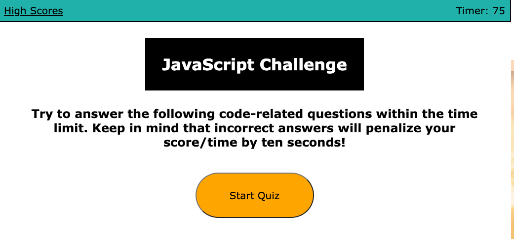

# javascript-quiz-challenge

## Purpose
A website that allows coding boot camp students to take a timed quiz on Javascript basics. The quiz stores the high scores so that the student can see how their score compares to their fellow classmates.

## Built With
* HTML
* CSS
* Javascript

## Website
https://pmac16.github.io/javascript-quiz-challenge/

## Description
When the student clicks the start button, a timer will begin (starting with 75 seconds). The student will be presented with the first of 5 questions about Javascript. 

If a student answers the question correctly, they move on to the next question. If student answers the question incorrectly, 10 seconds is subtracted from the clock. They also move on to the next question. Students are alerted if their question is correct or incorrect.

When all 5 questions are answered or the timer reaches 0, the game is over. The student is presented with their score, and a space to input their name for the leaderboard.

After saving their name, students are taken to the High Scores page. There they can see the top 3 scores and the players' names.

After viewing the scores, the students have the option to play again.

When the user scrolls down, they are presented with time blocks for the standard business hours. Each of these time blocks is color-coded to show if it is in the past, present, or future. 

When the user clicks into a time block, they are able to enter an event. After clicking the save button, the event is saved into local storage. The user can also edit the event and save.

### ©️Priya Macpherson